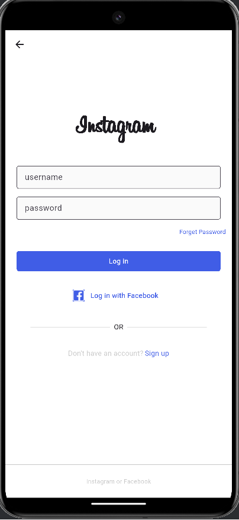
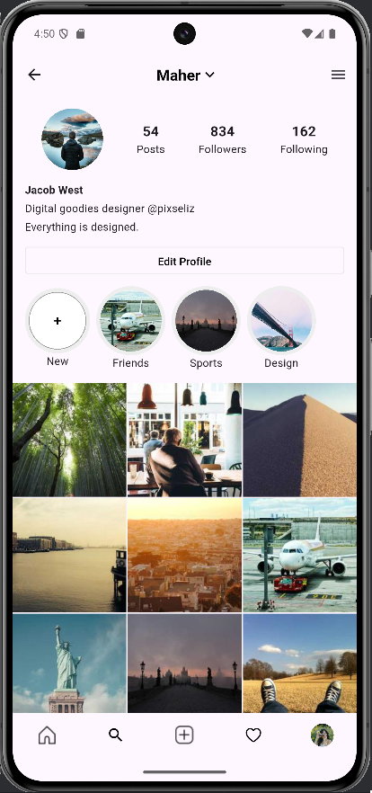

# Instagram Clone 📱

A fully functional Instagram clone built with Flutter, replicating the core features and UI of the popular social media platform.

## 📸 Screenshots

| Feature | Preview |
|---------|---------|
| **Switch Accounts** |  |
| **Login Screen** |  |
| **Home Page** |  |
| **Search Page** |  |
| **Notifications** |  |
| **User Profile** |  |
| **Settings Menu** |  |
| **Direct Messages** |  |

## 🚀 Getting Started

### Prerequisites
